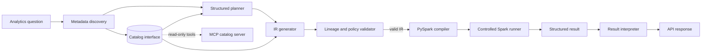

# agentic-data-analyst

`agentic-data-analyst` is an open-source reference implementation of a guarded analytics
agent. It turns a natural-language question into a catalog-grounded plan, a typed analysis
intermediate representation (IR), compiled PySpark DataFrame operations, bounded results,
and a concise explanation.

The repository is structured as an application rather than an agent-framework demo. LLM
communication, catalog access, planning, generation, validation, Spark execution,
interpretation, and HTTP transport have separate contracts. Generated text is never passed
to Python `exec()`.

## Architecture



The first model call selects datasets from lightweight catalog search results. Only those
schemas are sent into planning and generation. The LLM produces strict Pydantic objects at
each stage. The final analysis is a closed, versioned IR supporting dataset reads, joins,
filters, projections, aggregations, sorting, and limits. A deterministic compiler maps that
IR to Spark's DataFrame API.

See [docs/architecture.md](docs/architecture.md) for the dependency rules, execution model,
security boundary, and extension points.

## Capabilities

- Local discovery of Parquet datasets, Arrow data types, descriptions, tags, and declared
  relationships
- Focused metadata retrieval instead of placing the entire catalog in each prompt
- OpenRouter-compatible strict JSON Schema responses through a small provider interface
- Deterministic fake LLM responses for tests
- Typed, inspectable `spark_dataframe_ir/v1` with column-lineage validation
- Read-only PySpark execution with a mandatory output limit and JSON-safe results
- FastAPI health and analysis endpoints
- Read-only MCP tools for catalog search and schema lookup
- Reproducible synthetic players, sessions, matches, events, and purchases
- Unit and end-to-end integration tests that require neither credentials nor network access

## Quick start

Prerequisites are Python 3.12 and Java 17 or newer. The project uses Poetry for its lock file:

```bash
poetry install --extras dev
poetry run agentic-data-generate --output data/sample
```

Set `OPENROUTER_API_KEY` in your environment and choose a model that supports strict
structured output:

```bash
export OPENROUTER_API_KEY="..."
export OPENROUTER_MODEL="openai/gpt-4.1-mini"
poetry run uvicorn agentic_data_analyst.api.app:app --reload
```

The service is available at `http://localhost:8000`; its OpenAPI UI is at `/docs`.

## Example request

```bash
curl -s http://localhost:8000/analysis \
  -H 'content-type: application/json' \
  -d @examples/analysis_request.json
```

A successful response contains the plan, logical datasets, generated IR, a review-oriented
PySpark preview, validation findings, materialized rows, per-stage timings, and an
explanation. A shortened representative shape is:

```json
{
  "question": "What is average session duration by player segment?",
  "datasets_used": ["players", "sessions"],
  "validation": {"is_valid": true, "issues": []},
  "result": {
    "columns": ["segment", "average_duration", "session_count"],
    "rows": [
      {"segment": "competitive", "average_duration": 31.4, "session_count": 418}
    ],
    "row_count": 3,
    "truncated": false,
    "duration_ms": 842
  },
  "explanation": "The result compares mean session minutes and observed session counts by segment."
}
```

Values depend on the generated snapshot and the analysis selected by the configured model.

## Workflow

1. Catalog search ranks compact dataset summaries against the question.
2. The discovery model chooses the smallest useful dataset set from those candidates.
3. The planner sees only the selected annotated schemas and returns an `AnalysisPlan`.
4. The generator converts the plan to `spark_dataframe_ir/v1`.
5. Validation checks catalog authorization, canonical physical paths, selected columns,
   relation lineage, centralized complexity limits, supported operations, and the final row
   limit. A successful check creates an internal capability containing the authorized path
   and output-lineage snapshot.
6. The compiler accepts that capability and maps the IR to Spark DataFrame calls; it does
   not look paths up again or evaluate source code supplied by the model.
7. Immediately before execution, the runner repeats authorization, collects at most the
   requested maximum plus one truncation sentinel, and normalizes values for JSON.
8. An optional structured model call explains the result rows.

Each stage is directly testable and reports elapsed time. Provider prompts remain internal
and are not returned by the API.

## Guardrails and security model

The execution boundary uses representational safety. The IR has no nodes for imports,
filesystem APIs, environment access, networking, processes, dynamic evaluation, Spark SQL,
or writes. Pydantic rejects unknown operations and fields before semantic validation. The
validator then resolves every dataset and column against the catalog, canonicalizes each
existing Parquet path and verifies containment with a path-aware check, validates
intermediate relation lineage, enforces plan and expression complexity limits, and requires
a bounded final output. The runner performs authorization immediately before execution and
the compiler can read only the resulting path snapshot.

Provider calls use strict JSON Schema, an explicit timeout, and a bounded response body.
Questions and catalog text are marked as untrusted prompt data; prompt wording is not the
security boundary. See [SECURITY.md](SECURITY.md) for the threat model and reporting process.

This is defense in depth for the generated analysis, not a general hostile multi-tenant
sandbox. Spark and the API still run in the application process, the OpenRouter provider
receives the question and selected metadata, and operators control the catalog directory.
The execution deadline uses Spark job-group cancellation and is best effort; it cannot
forcibly stop blocked JVM or native code.

For untrusted tenants, add process or container isolation, resource quotas, authentication,
request limits, audit storage, and provider data-governance controls.

## Development

Useful commands are collected in the Makefile:

```bash
make install       # install locked dependencies
make data          # generate deterministic sample Parquet
make format        # apply Ruff formatting and safe fixes
make check         # Ruff, mypy, and pytest
make api           # run the development API
make mcp           # run the read-only catalog MCP server over stdio
```

The complete quality-gate commands are:

```bash
poetry run ruff check .
poetry run ruff format --check .
poetry run mypy
poetry run pytest
```

Tests use `FakeLLMClient` and generated temporary Parquet data. The integration test covers
question → discovery → planning → IR → validation → Spark → result → explanation through the
HTTP API.

## Docker

The image includes Java, installs the package, generates a small deterministic catalog, and
runs the API as an unprivileged user:

```bash
docker build -t agentic-data-analyst .
docker run --rm -p 8000:8000 \
  -e OPENROUTER_API_KEY \
  -e OPENROUTER_MODEL \
  agentic-data-analyst
```

## Limitations

- The IR intentionally covers a compact analytical subset. Window functions, pivots,
  unions, and reusable subqueries are not implemented.
- Relative phrases such as “last month” are interpreted by the model; there is no dedicated
  semantic date resolver yet.
- Catalog ranking is lexical and local. It does not provide statistics, access control, or
  an enterprise metastore implementation.
- Execution is local in-process Spark without per-request CPU or memory quotas. Deadline
  cancellation is cooperative and does not provide a hard wall-clock bound.
- There is no conversation state, clarification turn, authentication, or persistent audit
  store.

## Roadmap

1. Add a semantic date and metric layer so retention, churn, and conversion definitions are
   versioned independently from prompts.
2. Run Spark jobs in isolated workers with cancellation, resource budgets, and durable audit
   events.
3. Add an enterprise catalog adapter and policy hooks while preserving the current `Catalog`
   interface.

## License

MIT. See [LICENSE](LICENSE).
