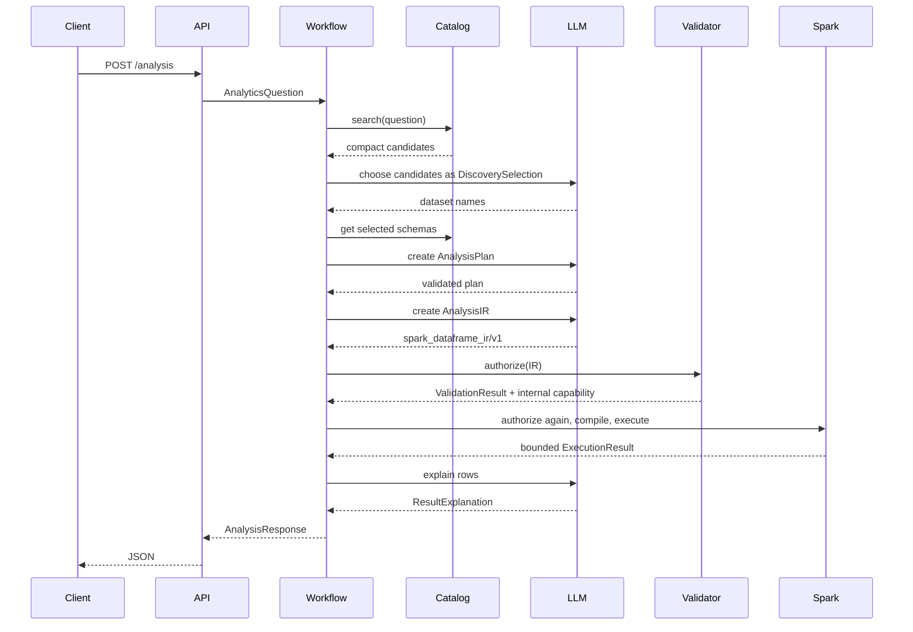

# Architecture

## Design goals

The system demonstrates a maintainable boundary between probabilistic reasoning and
deterministic data execution. An LLM may choose data and describe an analysis, but it cannot
provide executable source to the runtime. Every transition between stages uses a versioned,
validated model.

The initial implementation optimizes for one coherent local vertical slice. It deliberately
does not imitate a specific enterprise platform and contains no vendor-specific catalog or
business schema.

## Components and dependency direction

| Area | Responsibility | Depends on |
| --- | --- | --- |
| `models.py` | Shared immutable contracts and the analysis IR | Pydantic, policy constants |
| `policy.py` | Central structural and operational analysis limits | Standard library |
| `llm/` | Structured completion protocol, OpenRouter adapter, deterministic fake | Models, HTTPX |
| `catalog/` | Dataset discovery, metadata search, schema lookup | Models, PyArrow |
| `agents/` | Discovery, planning, IR generation, interpretation | LLM and model contracts |
| `guardrails/` | Catalog authorization, path checks, expression and lineage validation | Catalog and models |
| `execution/` | Deterministic IR compiler, Spark lifecycle, bounded collection | Guardrails, PySpark |
| `workflow.py` | Stage orchestration, timing, failure propagation | All application stages |
| `api/` | HTTP request/response and error mapping | Workflow |
| `mcp/` | Read-only external catalog tool boundary | Catalog |
| `bootstrap.py` | Production dependency composition | Concrete adapters |

Lower-level components never import the API or workflow. Provider-specific behavior remains
inside `llm/`, and physical catalog behavior remains inside `catalog/`. `bootstrap.py` is the
only location that wires production adapters together.

## Request sequence

## Catalog discovery

`Catalog` is a structural protocol with three operations: list summaries, search summaries,
and get one detailed dataset. `LocalParquetCatalog` discovers `*.parquet` files or directories
under one configured root, reads their physical schemas through Arrow, and merges optional
`<dataset>.metadata.json` annotations.

Search operates over names, descriptions, tags, and column names but returns only compact
`CatalogCandidate` objects. Detailed columns and relationships enter prompts only after the
discovery step. Ranking is deterministic lexical token overlap, not semantic search. A
future catalog adapter can implement the same protocol without changing agents or execution.

The MCP server exposes search and single-schema lookup as read-only tools. The internal
workflow calls the catalog interface directly because an in-process protocol hop adds no
useful isolation. MCP is retained at the external boundary where another agent or process can
discover metadata without filesystem access.

## Analysis representation

`spark_dataframe_ir/v1` is an ordered relational graph. Inputs identify catalog datasets,
aliases, and the minimum selected columns. Each input column is renamed
`<alias>__<column>` to make join lineage explicit. Steps consume prior relation names and
produce immutable new relation names.

Supported relation nodes are:

- join with equality or another supported expression and a fixed join type;
- filter with a closed boolean expression tree;
- projection to explicitly named expressions;
- aggregation with named groups and a fixed aggregate function set;
- sort with explicit direction and null ordering;
- limit.

Supported expressions include column and scalar literals, comparisons, boolean and numeric
operators, null checks, `to_date`, `date_diff`, `date_trunc`, `coalesce`, and conditional
`when`. Pydantic validation uses strict types, constrains identifiers and node shape, and
forbids extra fields. Semantic validation propagates coarse boolean, numeric, string, and
temporal types from Arrow schemas through every relation; operations that would depend on
implicit Spark casts are rejected. A centralized policy further bounds inputs, selected
columns, relational steps, joins, projections, group keys, aggregations, sort keys,
expression depth and node count, and result rows.

## Validation and execution

Validation builds relation schemas in step order. It checks every input against catalog
columns, requires an existing absolute path, resolves symlinks, verifies path containment
with `Path.is_relative_to`, rejects duplicate names and forward references, validates every
column expression and its operand types against the current relation, restricts date
truncation units, and requires the declared output to be a final bounded limit step.
Successful authorization produces an internal `ValidatedAnalysis` capability containing
canonical paths, selected columns, and the expected output lineage.

`SparkCompiler` accepts only this capability and constructs DataFrames through an exhaustive
dispatch over the closed node set. There is no Python source parser or evaluator in the
execution path, no Spark SQL string, and no catalog lookup in the compiler. Inputs are
Parquet reads from the authorized path snapshot; the IR has no write node.
`SparkAnalysisRunner` authorizes immediately before execution, checks the compiled output
columns against validated lineage, collects at most the requested maximum plus one sentinel
row, and converts dates and decimals to JSON-safe scalar values.

The `pyspark_preview` returned to clients is for review and observability. It is generated
from the validated capability by the deterministic compiler and is never evaluated.

## Failure model

Expected failures use application exceptions:

- `CatalogError`: missing or malformed local metadata;
- `LLMError`: provider transport failure, invalid structured response, or invented schema;
- `UnsafeAnalysisError`: semantic validation rejected the IR;
- `ExecutionError`: Spark failed after validation;
- `ExecutionTimeoutError`: best-effort Spark job-group cancellation reached its deadline.

The API maps these to stable HTTP statuses and does not include underlying provider bodies,
credentials, prompts, Spark traces, or exception causes. Operational deployments should log
correlation IDs and sanitized stage events in a dedicated observability adapter.

## Concurrency and lifecycle

One lazily initialized Spark session is shared per process and is stopped by the FastAPI
lifespan. The asynchronous workflow moves blocking Spark execution to a worker thread.
Spark itself can execute jobs concurrently, but this reference implementation does not
implement admission control. A configurable timer cancels the request's Spark job group;
Spark cancellation is cooperative and is not a hard timeout. Production deployments should
place jobs behind a queue or isolated worker pool and enforce tenant-aware budgets.

## Trust boundaries and residual risks

The question, provider response, and descriptive catalog fields are untrusted. The catalog
root, files within it, runtime configuration, application code, Python process, JVM, and
Spark installation are operator-controlled and trusted. The capability snapshot closes the
catalog re-query gap, but a privileged actor who mutates a file between authorization and
Spark opening it remains outside the threat model. In-process Spark does not isolate hostile
tenants, enforce memory or CPU quotas, or guarantee cancellation of blocked JVM/native work.
The OpenRouter provider sees the question and selected schema metadata.

## Testing strategy

Unit tests isolate catalog discovery, metadata search, provider response validation, planning
constraints, guardrails, compiler semantics, Spark execution, and HTTP error mapping. They
include traversal and symlink cases, complexity limits, malformed provider responses, and
prompt-injection proposals for filesystem, environment, network, process, SQL, Python, write,
and Spark-configuration operations. A single integration test assembles real local Parquet
and Spark adapters with a queued fake LLM, then drives the complete workflow through FastAPI.
No test makes a network request or requires a credential.

## Extension points

The most useful next boundary is a semantic metrics service that resolves approved metric
definitions into IR fragments. After that, add an isolated execution protocol and an
enterprise catalog adapter. Both can fit the existing workflow without weakening the typed
LLM boundary.
